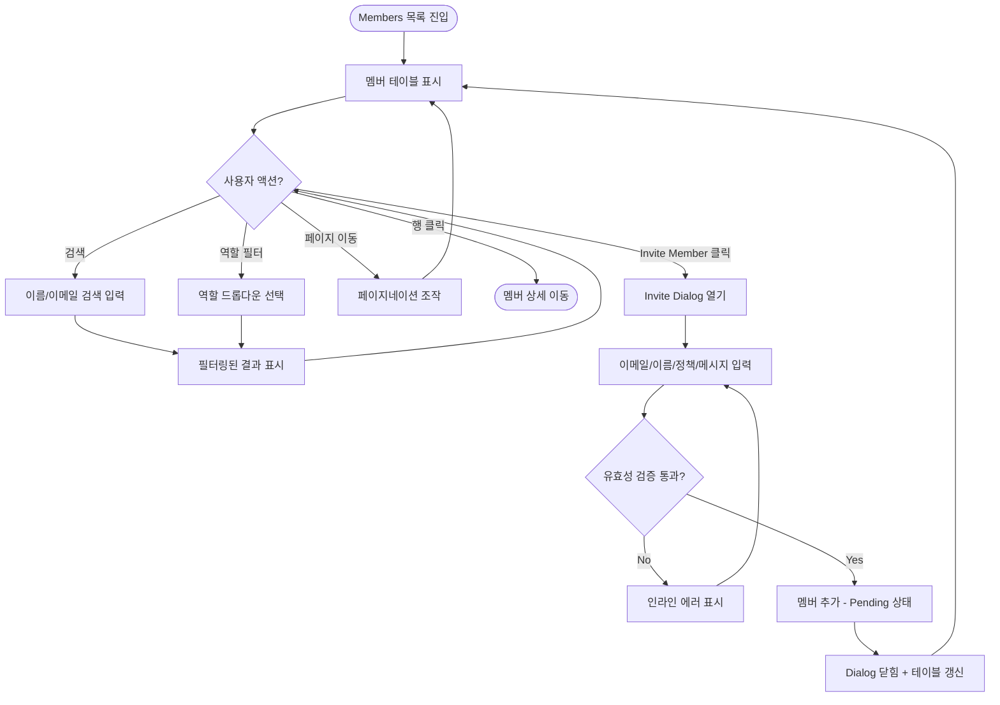
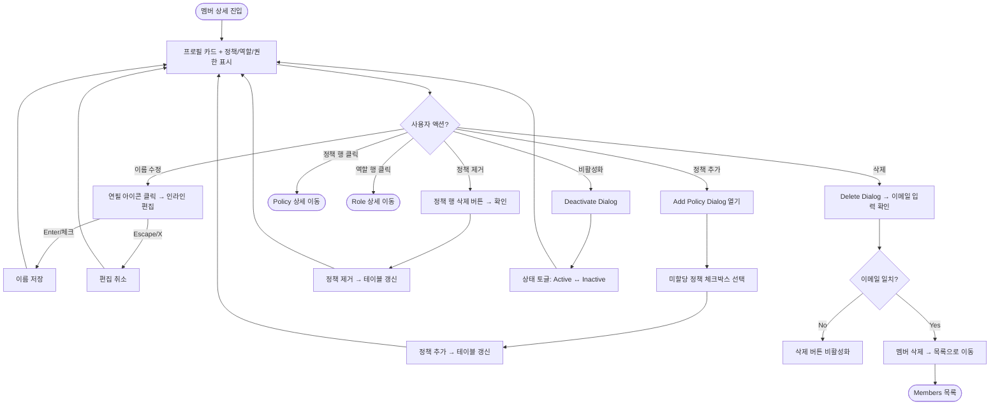

# Members Management — Front-end Hand-off

> **Scope**: Members 관리 영역 (목록 + 상세 + 다이얼로그)
> **Base URL**: `/ws/:wsid/management/members`
> **Date**: 2026-03-02

---

## 1. URL & Route Map

| URL | 화면 | 설명 |
|-----|------|------|
| `/ws/:wsid/management/members` | Members 목록 | 멤버 테이블, 검색, 필터, 초대 |
| `/ws/:wsid/management/members/:memberId` | Members 상세 | 프로필, 정책, 역할, 권한 |

**인접 라우트 (Members에서 내비게이션 가능)**

| URL | 화면 | 진입 경로 |
|-----|------|----------|
| `/ws/:wsid/management/policies/:policyId` | Policy 상세 | 멤버 상세 → 정책 행 클릭 |
| `/ws/:wsid/management/roles/:roleId` | Role 상세 | 멤버 상세 → 역할 행 클릭 |
| `/ws/:wsid/management/policies` | Policy 목록 | 멤버 상세 → "Policy Management →" 링크 |
| `/ws/:wsid/management/roles` | Role 목록 | 멤버 상세 → "Role Management →" 링크 |

---

## 2. 사이드바 내비게이션

```
Management (그룹 레이블)
├── Members       ← 현재 영역
├── Roles
└── Policies
```

- `Management`은 접히지 않는 플랫 그룹
- 각 메뉴 아이콘: Members(Users), Roles(FileText), Policies(ShieldCheck)
- Active 상태: 현재 URL과 매칭 시 하이라이트

---

## 3. 유저 플로우

### 3.1 Members 목록 (List)



### 3.2 Members 상세 (Detail)



---

## 4. 화면별 UI 구성

### 4.1 Members 목록 페이지

#### 헤더 영역

| 요소 | 타입 | 설명 |
|------|------|------|
| 제목 | `h1` + Badge | "Members" + 총 멤버 수 배지 (예: `21`) |
| 설명 | `p` | "Manage workspace members and their access permissions" |
| 검색 | `Input` | placeholder: "Search members..." / 이름, 이메일 대소문자 무시 필터 |
| 역할 필터 | `Select` | "All Roles" (기본) + 역할 목록 동적 생성 |
| CTA 버튼 | `Button` | "+ Invite Member" / 우측 상단 |

#### 테이블

| 컬럼 | 설명 | 비고 |
|------|------|------|
| Select | 체크박스 (행 선택) | 전체선택 포함 |
| Name | 아바타(이니셜) + 이름 | 아바타 배경: 이름 해시 기반 그라데이션 |
| Email | 이메일 주소 | — |
| Roles | 역할 배지 (최대 2개) | 3개 이상 시 `+N` 표시 |
| Status | 상태 배지 | Active(초록), Inactive(회색), Pending(노랑) |
| Joined | 가입일 | `MMM dd, yyyy` 포맷 |

#### 페이지네이션

| 요소 | 설명 |
|------|------|
| Rows per page | 드롭다운: 5 / 10 / 20 / 50 |
| 페이지 표시 | "Page X of Y" |
| 이전/다음 | `<` `>` 버튼 (1페이지/마지막 페이지에서 비활성화) |

#### Empty State

- 멤버 0명일 때 표시
- 아이콘 + "No members yet" 메시지 + "Invite Member" CTA 버튼

---

### 4.2 Members 상세 페이지

#### Breadcrumb

```
Members > {멤버 이름}
```

#### 프로필 카드 (MemberDetailHeader)

| 요소 | 설명 | 인터랙션 |
|------|------|---------|
| 아바타 | 이니셜, 큰 사이즈 | — |
| 이름 | 텍스트 + 연필 아이콘 | 클릭 시 인라인 Input으로 전환 |
| Status 배지 | Active / Inactive / Pending | — |
| Member ID | `mem-XXX` + 복사 아이콘 | 클릭 시 클립보드 복사 + 툴팁 |
| Email | 아이콘 + 이메일 | — |
| Created | 아이콘 + 생성일 | `MMM dd, yyyy` |
| Last Login | 아이콘 + 마지막 접속 | `MMM dd, yyyy, hh:mm a` |
| Deactivate 버튼 | 우측 상단 | Active → "Deactivate" / Inactive → "Activate" |
| Delete 버튼 | 우측 상단, 빨간색 | destructive 스타일 |

**인라인 이름 편집:**
- 연필 아이콘 클릭 → Input 필드 전환
- 저장: `Enter` 키 또는 체크(✓) 버튼
- 취소: `Escape` 키 또는 X 버튼
- 빈 값 또는 변경 없으면 저장 불가

#### Assigned Policies 섹션

| 요소 | 설명 |
|------|------|
| 제목 | "Assigned Policies" + 개수 배지 |
| + Add Policy | 정책 추가 다이얼로그 열기 |
| Policy Management → | `/ws/:wsid/management/policies`로 이동 링크 |
| 테이블 컬럼 | Name / Description / Created Date / Action(삭제) |
| 행 클릭 | Policy 상세 페이지 이동 |
| 삭제 버튼 | 확인 다이얼로그 → 정책 해제 |
| Empty | "No policies assigned" 메시지 |

#### Effective Roles 섹션

| 요소 | 설명 |
|------|------|
| 제목 | "Effective Roles" + 개수 배지 |
| Role Management → | `/ws/:wsid/management/roles`로 이동 링크 |
| 테이블 컬럼 | Select / Name / Description / Scope |
| Scope 배지 | `workspace` (파랑) / `cross-workspace` (보라) |
| 행 클릭 | Role 상세 페이지 이동 |
| 읽기 전용 | 직접 수정 불가 (정책을 통해서만 변경) |

#### Effective Permissions 섹션

| 요소 | 설명 |
|------|------|
| 제목 | "Effective Permissions" (Collapsible) |
| 기본 상태 | 접힌 상태 |
| 그룹핑 | 도메인별 (DASHBOARD, SERVER, APM, LOG, etc.) |
| 각 권한 표시 | 권한 이름(코드) + Action 배지 + Scope 배지 + 출처(via Role in Policy) |
| Action 색상 | READ(초록), CREATE(파랑), UPDATE(노랑), DELETE(빨강) |

---

## 5. 다이얼로그 (Dialogs)

### 5.1 Invite Member Dialog

| 필드 | 타입 | 필수 | Validation |
|------|------|------|-----------|
| Email | `Input` | O | RFC 5322 이메일 형식 + 중복 체크(500ms debounce) |
| Name | `Input` | X | 최대 100자 |
| Policy 선택 | `Checkbox` 리스트 | O (1개 이상) | 스크롤 영역, 각 정책에 역할 배지 표시 |
| Welcome Message | `Textarea` | X | 최대 500자 |

**에러 메시지:**
- 이메일 미입력: "Please enter a valid email address"
- 이메일 형식 오류: "Please enter a valid email address"
- 이메일 중복: "This email is already registered"
- 이름 초과: "Name must be 100 characters or fewer"
- 메시지 초과: "Message must be 500 characters or fewer"

**동작:**
- 다이얼로그 닫힘 시 모든 필드 초기화
- Submit 성공 → 다이얼로그 자동 닫힘 + 테이블 갱신
- 새 멤버는 `pending` 상태로 생성

### 5.2 Delete Member Dialog

| 요소 | 설명 |
|------|------|
| 타입 | `AlertDialog` (destructive) |
| 제목 | "Delete Member" |
| 설명 | "This action cannot be undone. This will permanently delete **{이름}** and remove all associated policy assignments." |
| 확인 입력 | 멤버 이메일 입력 (대소문자 무시 비교) |
| 삭제 버튼 | 이메일 불일치 시 `disabled` / 일치 시 활성화 |
| 삭제 후 | Members 목록으로 이동 |

### 5.3 Deactivate/Activate Member Dialog

| 요소 | 설명 |
|------|------|
| 타입 | `AlertDialog` |
| 동작 | 현재 상태 반전 (Active → Inactive, Inactive → Active) |
| 확인 후 | 상태 변경 + 다이얼로그 닫힘 + 프로필 갱신 |

### 5.4 Add Policy to Member Dialog

| 요소 | 설명 |
|------|------|
| 타이틀 | "Add Policy" |
| 내용 | 미할당 정책 목록 (체크박스 멀티 선택) |
| 각 정책 표시 | 정책명 + 설명 + 포함 역할 배지 |
| Submit | 선택된 정책이 없으면 `disabled` |
| 전체 할당 시 | "All policies are already assigned" 메시지 |

---

## 6. 컴포넌트 의존성 트리

```
MembersPage (pages/.../members/index.tsx)
├── ManagementPageHeader
│   └── MembersRoleFilter (Select)
├── MembersTable (DataTable)
│   └── MembersEmptyState
└── InviteMemberDialog (Dialog + Zod)

MemberDetailPage (pages/.../members/$memberId.tsx)
├── MemberDetailHeader
│   ├── Avatar + 인라인 편집
│   └── Deactivate / Delete 버튼
├── MemberPoliciesTable (DataTable)
├── MemberRolesTable (DataTable)
├── MemberEffectivePermissions (Collapsible)
├── AddPolicyToMemberDialog (Dialog)
├── DeleteMemberDialog (AlertDialog)
└── DeactivateMemberDialog (AlertDialog)
```

---

## 7. 상태 관리

| 상태 | 스코프 | 설명 |
|------|--------|------|
| `searchQuery` | 목록 페이지 | 검색어 (이름/이메일) |
| `roleFilter` | 목록 페이지 | 선택된 역할 필터 (`'all'` 기본) |
| `page` / `pageSize` | 목록 페이지 | 페이지네이션 (기본: 1 / 10) |
| `isInviteOpen` | 목록 페이지 | Invite Dialog 열림 여부 |
| `refreshKey` | 목록/상세 | 데이터 갱신 트리거 (increment) |
| `isAddPolicyOpen` | 상세 페이지 | Add Policy Dialog |
| `isDeleteOpen` | 상세 페이지 | Delete Dialog |
| `isDeactivateOpen` | 상세 페이지 | Deactivate Dialog |

> **현재 데이터 방식**: 클라이언트 Mock 데이터 (in-memory). `refreshKey` 증가로 `useMemo` 재계산.
> **향후**: TanStack Query(`useSuspenseQuery`) + 서버 API로 전환 예정.

---

## 8. 데이터 모델 (UI 관점)

### Member

```typescript
interface Member {
  id: string;             // "mem-001"
  name: string;           // "Sarah Kim"
  email: string;          // "sarah.kim@opsgent.io"
  status: 'active' | 'inactive' | 'pending';
  createdAt: string;      // ISO 8601
  lastLoginAt: string | null;
  policyIds: string[];    // 연결된 정책 ID 배열
}
```

### Policy (멤버 상세에서 사용)

```typescript
interface Policy {
  id: string;
  name: string;
  description: string;
  createdAt: string;
  roleIds: string[];
  memberIds: string[];
}
```

### Role (멤버 상세에서 사용)

```typescript
interface Role {
  id: string;
  name: string;
  description: string;
  type: 'default' | 'custom';
  scope: 'workspace' | 'cross-workspace';
  permissionIds: string[];
}
```

### EffectivePermission (멤버 상세에서 사용)

```typescript
interface EffectivePermission {
  id: string;
  name: string;
  domain: string;       // DASHBOARD, SERVER, APM, LOG, etc.
  action: string;       // READ, CREATE, UPDATE, DELETE
  scope: string;        // workspace, cross-workspace
  description: string;
  sourceRoleName: string;     // "via Viewer"
  sourcePolicyName: string;   // "in Production Read-Only"
}
```

---

## 9. UI 컴포넌트 위치 (파일 맵)

```
src/
├── pages/_authenticated/ws/$wsid/_workspace/management/members/
│   ├── index.tsx                          # 목록 페이지
│   └── $memberId.tsx                      # 상세 페이지
│
├── widgets/management/ui/
│   ├── management-page-header.tsx         # 공통 헤더 (제목+검색+필터+CTA)
│   ├── members-table.tsx                  # 멤버 테이블 (DataTable)
│   ├── members-role-filter.tsx            # 역할 필터 (Select)
│   ├── members-empty-state.tsx            # Empty state
│   ├── invite-member-dialog.tsx           # 초대 다이얼로그 (Zod)
│   ├── member-detail-header.tsx           # 상세 프로필 카드
│   ├── member-policies-table.tsx          # 할당 정책 테이블
│   ├── member-roles-table.tsx             # 유효 역할 테이블
│   ├── member-effective-permissions.tsx   # 유효 권한 (Collapsible)
│   ├── add-policy-to-member-dialog.tsx    # 정책 추가 다이얼로그
│   ├── delete-member-dialog.tsx           # 삭제 확인 다이얼로그
│   └── deactivate-member-dialog.tsx       # 비활성화 다이얼로그
│
├── entities/management/
│   ├── model/management.types.ts          # 타입 정의
│   └── api/management.mock.ts            # Mock 데이터 + 쿼리/뮤테이션
│
└── shared/components/ui/                  # shadcn 기반 공용 컴포넌트
    ├── data-table.tsx
    ├── dialog.tsx / alert-dialog.tsx
    ├── button.tsx / input.tsx / textarea.tsx
    ├── badge.tsx / avatar.tsx
    ├── select.tsx / checkbox.tsx
    ├── collapsible.tsx / tooltip.tsx
    └── ...
```

---

## 10. Figma 디자인 참조

| 화면 | Figma Node ID | 링크 |
|------|--------------|------|
| 멤버 관리 (목록) | `2404:3483` | [Figma](https://www.figma.com/design/y5bosVJQewFatHUicHl4Bn/-WorkSpace--UX-UI-Design-Assets?node-id=2404-3483) |
| 멤버 상세 | `2404:3501` | [Figma](https://www.figma.com/design/y5bosVJQewFatHUicHl4Bn/-WorkSpace--UX-UI-Design-Assets?node-id=2404-3501) |
| 멤버 초대 | `2404:3637` | [Figma](https://www.figma.com/design/y5bosVJQewFatHUicHl4Bn/-WorkSpace--UX-UI-Design-Assets?node-id=2404-3637) |

> **파일럿 제외 사항** (Figma 빨간 어노테이션):
> - 멤버 관리: '연결된 정책' 컬럼 제외
> - 멤버 초대: 전체 워크플로우 디자인 미완성

---

## 11. 파일럿 범위 체크리스트

| 기능 | 상태 | 비고 |
|------|------|------|
| 멤버 목록 테이블 | **구현 완료** | 검색, 역할 필터, 페이지네이션 |
| 멤버 상세 프로필 | **구현 완료** | 인라인 이름 편집, ID 복사 |
| 멤버 초대 (Invite) | **구현 완료** | Zod 유효성, 중복 이메일 체크, 정책 선택 |
| 정책 할당/해제 | **구현 완료** | Add Policy + Remove with confirm |
| 유효 역할 표시 | **구현 완료** | 읽기 전용, 정책 통해 파생 |
| 유효 권한 표시 | **구현 완료** | 도메인 그룹핑, 출처 추적 |
| 멤버 비활성화/활성화 | **구현 완료** | 확인 다이얼로그 |
| 멤버 삭제 | **구현 완료** | 이메일 확인 후 삭제 |
| Empty State | **구현 완료** | 멤버 0명 시 초대 CTA |
