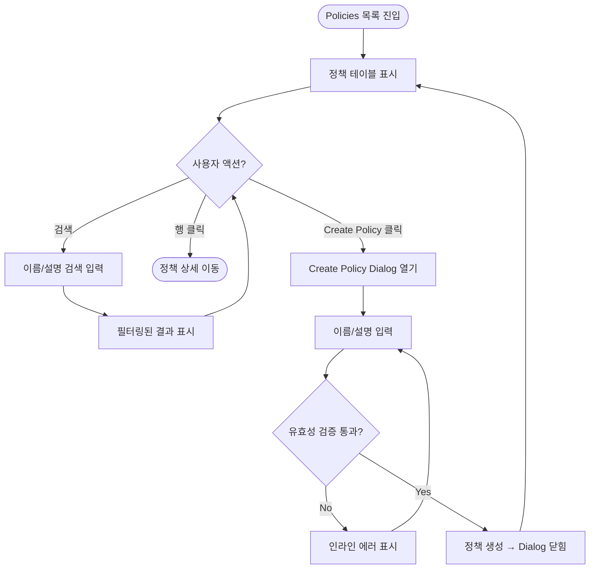
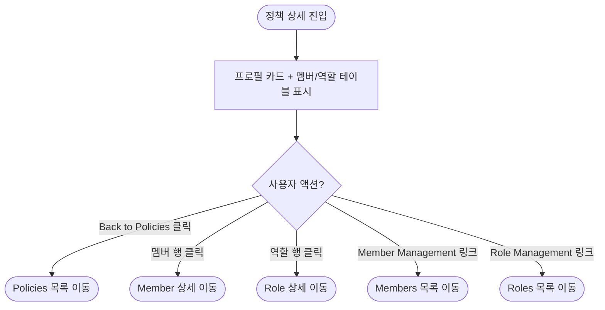

# Policies Management — Front-end Hand-off

> **Scope**: Policies 관리 영역 (목록 + 상세 + 생성 다이얼로그)
> **Base URL**: `/ws/:wsid/management/policies`
> **Date**: 2026-03-02

---

## 1. URL & Route Map

| URL | 화면 | 설명 |
|-----|------|------|
| `/ws/:wsid/management/policies` | Policies 목록 | 정책 테이블, 검색, 생성 |
| `/ws/:wsid/management/policies/:policyId` | Policy 상세 | 정책 프로필, 멤버 목록, 역할 목록 |

**인접 라우트 (Policies에서 내비게이션 가능)**

| URL | 화면 | 진입 경로 |
|-----|------|----------|
| `/ws/:wsid/management/members/:memberId` | Member 상세 | 정책 상세 → 멤버 행 클릭 |
| `/ws/:wsid/management/roles/:roleId` | Role 상세 | 정책 상세 → 역할 행 클릭 |
| `/ws/:wsid/management/members` | Member 목록 | 정책 상세 → "Member Management →" 링크 |
| `/ws/:wsid/management/roles` | Role 목록 | 정책 상세 → "Role Management →" 링크 |

---

## 2. 사이드바 내비게이션

```
Management (그룹 레이블)
├── Members
├── Roles
└── Policies      ← 현재 영역
```

- `Management`은 접히지 않는 플랫 그룹
- 각 메뉴 아이콘: Members(Users), Roles(FileText), Policies(ShieldCheck)
- Active 상태: 현재 URL과 매칭 시 하이라이트

---

## 3. 유저 플로우

### 3.1 Policies 목록 (List)



### 3.2 Policy 상세 (Detail)



---

## 4. 화면별 UI 구성

### 4.1 Policies 목록 페이지

#### 헤더 영역

| 요소 | 타입 | 설명 |
|------|------|------|
| 제목 | `h1` | "Policies" |
| 설명 | `p` | "Manage access policies that define member permissions" |
| 검색 | `Input` | placeholder: "Search policies..." / 이름, 설명 대소문자 무시 필터 |
| CTA 버튼 | `Button` | "+ Create Policy" / 클릭 시 다이얼로그 열기 |

> **참고**: Policies 목록은 Members/Roles와 달리 Badge(총 개수)가 없으며, 추가 필터 요소도 없음

#### 테이블

| 컬럼 | 설명 | 비고 |
|------|------|------|
| Select | 체크박스 (행 선택) | pinned left |
| Policy Name | 정책 이름 | — |
| Description | 정책 설명 | — |
| Roles | 연결된 역할 수 (`roleIds.length`) | 정렬 불가 |
| Created | 생성일 | `MMM dd, yyyy` 포맷 |

> **참고**: 페이지네이션 없음 — 전체 목록 표시. 향후 데이터 증가 시 추가 예정.

---

### 4.2 Policy 상세 페이지

#### 내비게이션

| 요소 | 설명 |
|------|------|
| Back 버튼 | "← Back to Policies" ghost 버튼 → 목록으로 이동 |

> **참고**: Breadcrumb 대신 Back 버튼 패턴 사용 (Members/Roles의 Breadcrumb과 다름)

#### 프로필 카드 (PolicyDetailHeader)

| 요소 | 설명 | 인터랙션 |
|------|------|---------|
| 이름 | `h2` 텍스트 | 읽기 전용 (편집 불가) |
| 설명 | FileText 아이콘 + 설명 텍스트 | 읽기 전용 |
| Created | Calendar 아이콘 + 생성일 | `MMM dd, yyyy` |

> **참고**: 정책 상세는 현재 편집/삭제 기능 없음 (읽기 전용). 향후 추가 예정.

#### Members 섹션

| 요소 | 설명 |
|------|------|
| 제목 | "Members (N)" |
| Member Management → | `/ws/:wsid/management/members`로 이동 링크 |
| 테이블 컬럼 | Select / Name (아바타+이름) / Email / Status / Created |
| Status 배지 | Active(초록), Inactive(회색), Pending(노랑) |
| 행 클릭 | Member 상세 페이지 이동 |
| 페이지네이션 | `useClientPagination` 기반 자동 표시 |
| Empty | "No members assigned" 메시지 |

#### Roles 섹션

| 요소 | 설명 |
|------|------|
| 제목 | "Roles (N)" |
| Role Management → | `/ws/:wsid/management/roles`로 이동 링크 |
| 테이블 컬럼 | Select / Name / Description / Scope |
| Scope 배지 | Workspace(회색), Cross-WS(보라) |
| 행 클릭 | Role 상세 페이지 이동 |
| 페이지네이션 | `useClientPagination` 기반 자동 표시 |
| Empty | "No roles assigned" 메시지 |

---

## 5. 다이얼로그 (Dialogs)

### 5.1 Create Policy Dialog

| 필드 | 타입 | 필수 | Validation |
|------|------|------|-----------|
| Policy Name | `Input` | O | 1~100자 (Zod: `z.string().min(1).max(100)`) |
| Description | `Input` | O | 1~500자 (Zod: `z.string().min(1).max(500)`) |

**에러 메시지:**
- 이름 미입력: "Policy name is required"
- 설명 미입력: "Description is required"

**동작:**
- React 19 Form Action 패턴 사용 (`<form action={handleSubmit}>`)
- Submit 성공 → 다이얼로그 자동 닫힘
- 현재 Mock 데이터에 실제 추가하지 않음 (다이얼로그만 닫힘)
- 향후: API 연동 시 생성 후 목록 갱신 필요

**UI 구성:**
- Dialog 최대 너비: `sm:max-w-md`
- 제목: "Create Policy"
- 설명: "Define a new access policy for your workspace."
- Footer: Cancel(outline) + Create Policy(primary) 버튼

---

## 6. 컴포넌트 의존성 트리

```
PoliciesPage (pages/.../policies/index.tsx)
├── ManagementPageHeader
├── PoliciesTable (DataTable)
└── CreatePolicyDialog (Dialog + Zod)

PolicyDetailPage (pages/.../policies/$policyId.tsx)
├── PolicyDetailHeader
│   ├── Back 버튼 (← Back to Policies)
│   └── Card (이름 + 설명 + 생성일)
├── PolicyMembersTable (DataTable)
└── PolicyRolesTable (DataTable)
```

---

## 7. 상태 관리

| 상태 | 스코프 | 설명 |
|------|--------|------|
| `searchQuery` | 목록 페이지 | 검색어 (이름/설명) |
| `isCreateOpen` | 목록 페이지 | Create Policy Dialog 열림 여부 |
| `errors` | Create Dialog | Zod 유효성 에러 맵 |

> **현재 데이터 방식**: 클라이언트 Mock 데이터 (in-memory). `getAllPolicies()` 직접 호출.
> **향후**: TanStack Query(`useSuspenseQuery`) + 서버 API로 전환 예정.

> **참고**: 정책 상세 페이지는 `refreshKey` 패턴을 사용하지 않음 (편집 기능 없음).

---

## 8. 데이터 모델 (UI 관점)

### Policy

```typescript
interface Policy {
  id: string;             // "pol-001"
  name: string;           // "Full Access Policy"
  description: string;    // "Complete access to all workspace resources"
  createdAt: string;      // ISO 8601
  roleIds: string[];      // 연결된 역할 ID 배열
  memberIds: string[];    // 연결된 멤버 ID 배열
}
```

### Member (정책 상세에서 사용)

```typescript
interface Member {
  id: string;
  name: string;
  email: string;
  status: 'active' | 'inactive' | 'pending';
  createdAt: string;
  lastLoginAt: string | null;
  policyIds: string[];
}
```

### Role (정책 상세에서 사용)

```typescript
interface Role {
  id: string;
  name: string;
  description: string;
  type: 'default' | 'custom';
  scope: 'workspace' | 'cross-workspace';
  createdAt: string;
  permissionIds: string[];
}
```

---

## 9. UI 컴포넌트 위치 (파일 맵)

```
src/
├── pages/_authenticated/ws/$wsid/_workspace/management/policies/
│   ├── index.tsx                          # 목록 페이지
│   └── $policyId.tsx                      # 상세 페이지
│
├── widgets/management/ui/
│   ├── management-page-header.tsx         # 공통 헤더 (제목+검색+CTA)
│   ├── policies-table.tsx                 # 정책 테이블 (DataTable)
│   ├── create-policy-dialog.tsx           # 생성 다이얼로그 (Dialog + Zod)
│   ├── policy-detail-header.tsx           # 상세 프로필 카드
│   ├── policy-members-table.tsx           # 연결 멤버 테이블
│   └── policy-roles-table.tsx             # 연결 역할 테이블
│
├── entities/management/
│   ├── model/management.types.ts          # 타입 정의 (Policy, Member, Role 등)
│   └── api/management.mock.ts            # Mock 데이터 + 쿼리/뮤테이션
│
└── shared/components/ui/                  # shadcn 기반 공용 컴포넌트
    ├── data-table.tsx
    ├── dialog.tsx
    ├── button.tsx / input.tsx
    ├── badge.tsx / avatar.tsx / card.tsx
    └── ...
```

---

## 10. Figma 디자인 참조

| 화면 | Figma Node ID | 링크 |
|------|--------------|------|
| 정책 관리 (목록) | `2404:3410` | [Figma](https://www.figma.com/design/y5bosVJQewFatHUicHl4Bn/-WorkSpace--UX-UI-Design-Assets?node-id=2404-3410) |
| 정책 생성 | `2404:3409` | [Figma](https://www.figma.com/design/y5bosVJQewFatHUicHl4Bn/-WorkSpace--UX-UI-Design-Assets?node-id=2404-3409) |
| 정책 상세 | `2404:3447` | [Figma](https://www.figma.com/design/y5bosVJQewFatHUicHl4Bn/-WorkSpace--UX-UI-Design-Assets?node-id=2404-3447) |

> **파일럿 제외 사항** (Figma 빨간 어노테이션):
> - 정책 관리: '멤버 수' 컬럼 제외

---

## 11. 파일럿 범위 체크리스트

| 기능 | 상태 | 비고 |
|------|------|------|
| 정책 목록 테이블 | **구현 완료** | 검색 필터, 행 클릭 내비게이션 |
| 정책 생성 (Create) | **부분 구현** | Dialog UI + Zod 유효성 완료. Mock 데이터에 실제 추가 미연동 |
| 정책 상세 프로필 | **구현 완료** | 읽기 전용 (편집/삭제 없음) |
| 연결 멤버 테이블 | **구현 완료** | 행 클릭 → 멤버 상세, 페이지네이션 |
| 연결 역할 테이블 | **구현 완료** | 행 클릭 → 역할 상세, Scope 배지, 페이지네이션 |
| 정책 편집 | **미구현** | 향후 추가 예정 |
| 정책 삭제 | **미구현** | 향후 추가 예정 |
| 역할 할당/해제 | **미구현** | 향후 정책 상세에서 역할 추가/제거 기능 예정 |
| 멤버 할당/해제 | **미구현** | 향후 정책 상세에서 멤버 추가/제거 기능 예정 |
| 페이지네이션 (목록) | **미구현** | 현재 전체 목록 표시, 향후 추가 예정 |
