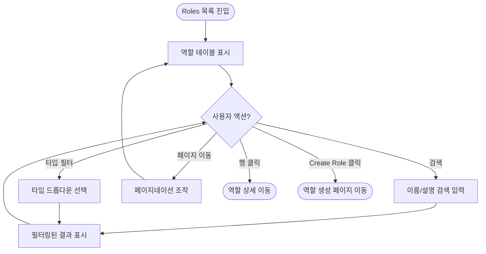
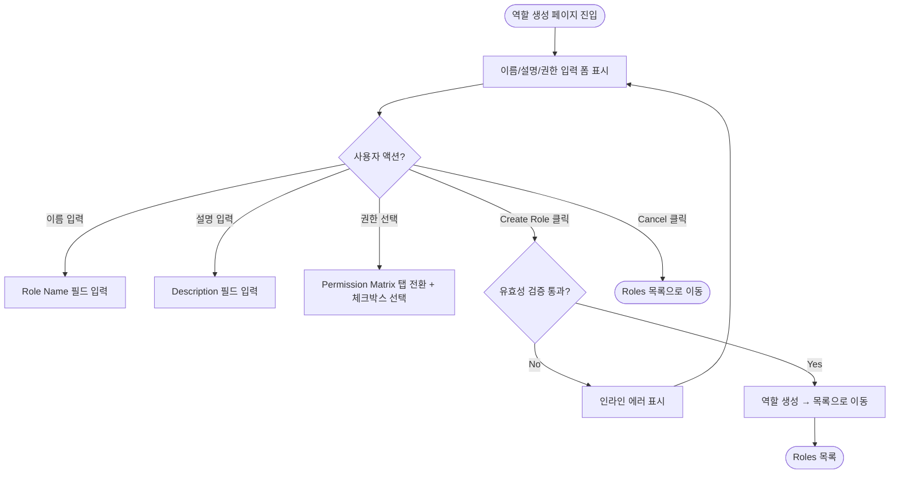
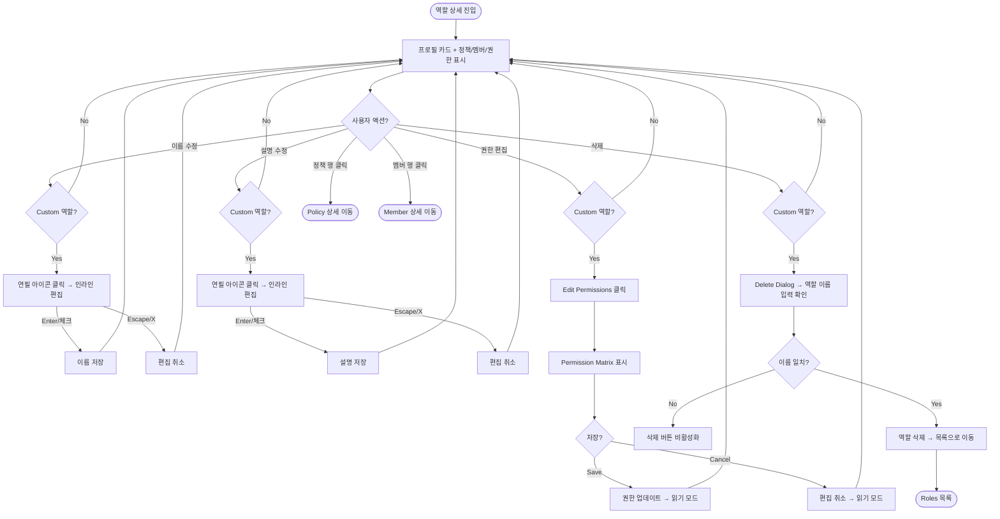

# Roles Management — Front-end Hand-off

> **Scope**: Roles 관리 영역 (목록 + 상세 + 생성 + 다이얼로그)
> **Base URL**: `/ws/:wsid/management/roles`
> **Date**: 2026-03-02

---

## 1. URL & Route Map

| URL | 화면 | 설명 |
|-----|------|------|
| `/ws/:wsid/management/roles` | Roles 목록 | 역할 테이블, 검색, 타입 필터, 생성 |
| `/ws/:wsid/management/roles/:roleId` | Role 상세 | 프로필, 정책, 멤버, 권한 |
| `/ws/:wsid/management/roles/create` | Role 생성 | 이름, 설명, 권한 매트릭스 |

**인접 라우트 (Roles에서 내비게이션 가능)**

| URL | 화면 | 진입 경로 |
|-----|------|----------|
| `/ws/:wsid/management/policies/:policyId` | Policy 상세 | 역할 상세 → 정책 행 클릭 |
| `/ws/:wsid/management/members/:memberId` | Member 상세 | 역할 상세 → 멤버 행 클릭 |
| `/ws/:wsid/management/policies` | Policy 목록 | 역할 상세 → "Policy Management →" 링크 |
| `/ws/:wsid/management/members` | Member 목록 | 역할 상세 → "Member Management →" 링크 |

---

## 2. 사이드바 내비게이션

```
Management (그룹 레이블)
├── Members
├── Roles         ← 현재 영역
└── Policies
```

- `Management`은 접히지 않는 플랫 그룹
- 각 메뉴 아이콘: Members(Users), Roles(FileText), Policies(ShieldCheck)
- Active 상태: 현재 URL과 매칭 시 하이라이트

---

## 3. 유저 플로우

### 3.1 Roles 목록 (List)



### 3.2 Role 생성 (Create)



### 3.3 Role 상세 (Detail)



---

## 4. 화면별 UI 구성

### 4.1 Roles 목록 페이지

#### 헤더 영역

| 요소 | 타입 | 설명 |
|------|------|------|
| 제목 | `h1` + Badge | "Roles" + 총 역할 수 배지 |
| 설명 | `p` | "Manage roles and their associated permissions" |
| 검색 | `Input` | placeholder: "Search roles..." / 이름, 설명 대소문자 무시 필터 |
| 타입 필터 | `Select` | "All Types" (기본) / "Default" / "Custom" |
| CTA 버튼 | `Button` | "+ Create Role" / 클릭 시 `/roles/create`로 이동 |

#### 테이블

| 컬럼 | 설명 | 비고 |
|------|------|------|
| Select | 체크박스 (행 선택) | pinned left |
| Role Name | 역할 이름 | — |
| Type | 타입 배지 | Default(회색), Custom(파랑) |
| Description | 역할 설명 | — |
| Scope | 스코프 배지 | Workspace(회색), Cross-WS(보라) |
| Policies | 연결된 정책 수 | 정렬 불가 |
| Permissions | 권한 수 (`permissionIds.length`) | 정렬 불가 |
| Created | 생성일 | `MMM dd, yyyy` 포맷 |

**정렬 규칙**: Default 역할이 먼저, 이후 `createdAt` 최신순

#### 페이지네이션

| 요소 | 설명 |
|------|------|
| Rows per page | 드롭다운: 5 / 10 / 20 / 50 |
| 페이지 표시 | "Page X of Y" |
| 이전/다음 | `<` `>` 버튼 (1페이지/마지막 페이지에서 비활성화) |

#### Empty State

- 역할 0개일 때 표시
- Shield 아이콘 + "No roles found" 메시지 + "Get started by creating your first custom role." + "+ Create Role" CTA 버튼

---

### 4.2 Role 생성 페이지

#### Breadcrumb

```
Roles > Create Role
```

#### 폼 (Card)

| 요소 | 타입 | 필수 | Validation |
|------|------|------|-----------|
| Role Name | `Input` | O | 3~50자, 영문/숫자/공백/하이픈만 (`/^[a-zA-Z0-9 -]+$/`), 이름 중복 체크 |
| Description | `Textarea` (rows=3) | O | 10~200자 |
| Permissions | `RolePermissionMatrix` | O (1개 이상) | 최소 1개 이상 선택 필수 |

**에러 메시지:**
- 이름 3자 미만: "Role name must be at least 3 characters"
- 이름 50자 초과: "Role name must be at most 50 characters"
- 이름 허용 문자 위반: "Role name can only contain letters, numbers, spaces, and hyphens"
- 이름 중복: "A role with this name already exists"
- 설명 10자 미만: "Description must be at least 10 characters"
- 설명 200자 초과: "Description must be at most 200 characters"
- 권한 미선택: "At least one permission must be selected"

#### Permission Matrix (RolePermissionMatrix)

| 요소 | 설명 |
|------|------|
| 탭 내비게이션 | 도메인별 탭 (DASHBOARD, LOG, ROLE, APM, WORKSPACE, SERVER, INCIDENT, EVENT, POLICY, MEMBER) |
| 탭 배지 | 선택된 권한 수 표시 (예: `SERVER 3`) |
| Domain Header | "Select all {DOMAIN} permissions (N/M)" + 전체선택 체크박스 |
| 체크박스 상태 | 전체 선택(checked) / 일부 선택(indeterminate) / 미선택(unchecked) |
| 각 권한 항목 | 체크박스 + 권한 이름 + Action 배지 + Scope 배지 + 설명 |
| Action 색상 | READ(초록), CREATE(파랑), UPDATE(노랑), DELETE(빨강) |
| Scope 배지 | Workspace / Cross-WS |
| 하단 카운터 | "{N} permission(s) selected" |

#### 액션 버튼

| 요소 | 설명 |
|------|------|
| Cancel | outline 버튼, Roles 목록으로 이동 |
| Create Role | primary 버튼, 제출 중 "Creating..." 텍스트 + `disabled` |

---

### 4.3 Role 상세 페이지

#### Breadcrumb

```
Roles > {역할 이름}
```

#### 프로필 카드 (RoleDetailHeader)

| 요소 | 설명 | 인터랙션 |
|------|------|---------|
| 이름 | 텍스트 + 연필 아이콘 (Custom만) | 클릭 시 인라인 Input으로 전환 |
| Type 배지 | Default(회색) / Custom(파랑) | — |
| Scope 배지 | Workspace / Cross-Workspace | — |
| Role ID | `role-XXX` + 복사 아이콘 | 클릭 시 클립보드 복사 + "Copied!" 툴팁 |
| 설명 | 아이콘 + 설명 텍스트 + 연필 아이콘 (Custom만) | 클릭 시 인라인 편집 |
| Created | 아이콘 + 생성일 | `MMM dd, yyyy` |
| Permissions 카운트 | Shield 아이콘 + "N permissions" | — |
| Delete 버튼 | 우측 상단, 빨간색 (Custom만) | destructive 스타일 |

**인라인 이름/설명 편집 (Custom 역할만):**
- 연필 아이콘 클릭 → Input 필드 전환
- 저장: `Enter` 키 또는 체크(✓) 버튼
- 취소: `Escape` 키 또는 X 버튼
- 빈 값 또는 변경 없으면 저장 불가
- Default 역할은 편집 불가 (연필 아이콘 비노출)

#### Policies 섹션

| 요소 | 설명 |
|------|------|
| 제목 | "Policies (N)" |
| Policy Management → | `/ws/:wsid/management/policies`로 이동 링크 |
| 테이블 컬럼 | Select / Name / Description / Created |
| 행 클릭 | Policy 상세 페이지 이동 |
| Empty | "No policies linked" 메시지 |

#### Members 섹션

| 요소 | 설명 |
|------|------|
| 제목 | "Members (N)" |
| Member Management → | `/ws/:wsid/management/members`로 이동 링크 |
| 테이블 컬럼 | Select / Name (아바타+이름) / Email / Status / Created |
| Status 배지 | Active(초록), Inactive(회색), Pending(노랑) |
| 행 클릭 | Member 상세 페이지 이동 |
| Empty | "No members linked" 메시지 |

#### Permissions 섹션

| 요소 | 설명 |
|------|------|
| 제목 | "Permissions (N)" |
| Edit Permissions 버튼 | Custom 역할만 표시, 편집 모드 토글 |
| 읽기 모드 | 권한 DataTable (Permission / Domain / Action / Scope / Description) |
| 편집 모드 | RolePermissionMatrix 표시 (탭 기반 체크박스) |
| Save / Cancel | 편집 모드에서 표시 |
| Domain 배지 | monospace 폰트, outline 스타일 |
| Action 배지 | READ(파랑), CREATE(초록), UPDATE(노랑), DELETE(빨강) |
| Scope 배지 | Workspace(회색), Cross-WS(보라) |
| Empty | "No permissions assigned" 메시지 |

**편집 모드 제약:**
- 최소 1개 이상 권한 선택 필수 (0개면 Save 불가)
- Default 역할은 Edit Permissions 버튼 비노출

---

## 5. 다이얼로그 (Dialogs)

### 5.1 Delete Role Dialog (Custom 역할 전용)

| 요소 | 설명 |
|------|------|
| 타입 | `AlertDialog` (destructive) |
| 제목 | "Delete Role" |
| 설명 | "This action cannot be undone. This will permanently delete the role **{역할 이름}**." |
| Impact Analysis | 연결된 정책 수 > 0 또는 영향 멤버 수 > 0일 때 amber 경고 박스 표시 |
| Impact 항목 1 | "Will be removed from **N** policy/policies (정책명1, 정책명2)" |
| Impact 항목 2 | "**N** member(s) will be affected" |
| 확인 입력 | 역할 이름 정확히 입력 (대소문자 구분) |
| 삭제 버튼 | 이름 불일치 시 `disabled` / 일치 시 활성화 |
| 삭제 후 | Roles 목록으로 이동 |

---

## 6. 컴포넌트 의존성 트리

```
RolesPage (pages/.../roles/index.tsx)
├── ManagementPageHeader
│   └── RolesTypeFilter (Select)
├── RolesTable (DataTable)
│   └── RolesEmptyState
└── (CTA → CreateRolePage로 navigate)

CreateRolePage (pages/.../roles/create.tsx)
├── Breadcrumb (Link → Roles 목록)
├── Card (Form)
│   ├── Input (Role Name) + Zod Validation
│   ├── Textarea (Description) + Zod Validation
│   └── RolePermissionMatrix (Tabs + Checkbox)
└── Cancel / Create Role 버튼

RoleDetailPage (pages/.../roles/$roleId.tsx)
├── RoleDetailHeader
│   ├── 인라인 이름/설명 편집 (Custom만)
│   ├── Type/Scope 배지
│   ├── ID 복사
│   └── Delete 버튼 (Custom만)
├── RolePoliciesTable (DataTable)
├── RoleMembersTable (DataTable)
├── RolePermissionsTable (DataTable / RolePermissionMatrix)
└── DeleteRoleDialog (AlertDialog, Custom만)
```

---

## 7. 상태 관리

| 상태 | 스코프 | 설명 |
|------|--------|------|
| `searchQuery` | 목록 페이지 | 검색어 (이름/설명) |
| `typeFilter` | 목록 페이지 | 타입 필터 (`'all'` / `'default'` / `'custom'`) |
| `page` / `pageSize` | 목록 페이지 | 페이지네이션 (기본: 1 / 10) |
| `refreshKey` | 목록 페이지 | 데이터 갱신 트리거 |
| `name` / `description` | 생성 페이지 | 폼 입력값 |
| `selectedPermissionIds` | 생성 페이지 | 선택된 권한 ID 배열 |
| `errors` | 생성 페이지 | Zod 유효성 에러 맵 |
| `isSubmitting` | 생성 페이지 | 제출 중 상태 |
| `refreshKey` | 상세 페이지 | 데이터 갱신 트리거 |
| `isDeleteOpen` | 상세 페이지 | Delete Dialog 열림 여부 |
| `isEditingPermissions` | 상세 페이지 | 권한 편집 모드 여부 |
| `editPermissionIds` | 상세 페이지 | 편집 중 권한 ID 배열 |

> **현재 데이터 방식**: 클라이언트 Mock 데이터 (in-memory). `refreshKey` 증가로 `useMemo` 재계산.
> **향후**: TanStack Query(`useSuspenseQuery`) + 서버 API로 전환 예정.

---

## 8. 데이터 모델 (UI 관점)

### Role

```typescript
interface Role {
  id: string;             // "role-001"
  name: string;           // "Viewer"
  description: string;    // "Read-only access..."
  type: 'default' | 'custom';
  scope: 'workspace' | 'cross-workspace';
  createdAt: string;      // ISO 8601
  permissionIds: string[];
}
```

### RoleImpact (삭제 시 영향 분석)

```typescript
interface RoleImpact {
  linkedPoliciesCount: number;
  affectedMembersCount: number;
  linkedPolicyNames: string[];
}
```

### Permission (역할에서 사용)

```typescript
interface Permission {
  id: string;
  name: string;             // "DASHBOARD_READ"
  domain: PermissionDomain; // "DASHBOARD"
  action: PermissionAction; // "READ"
  scope: PermissionScope;   // "workspace"
  description: string;
}

type PermissionDomain =
  | 'DASHBOARD' | 'LOG' | 'ROLE' | 'APM' | 'WORKSPACE'
  | 'SERVER' | 'INCIDENT' | 'EVENT' | 'POLICY' | 'MEMBER';

type PermissionAction = 'READ' | 'UPDATE' | 'CREATE' | 'DELETE';

type PermissionScope = 'workspace' | 'cross-workspace';
```

### Policy (역할 상세에서 사용)

```typescript
interface Policy {
  id: string;
  name: string;
  description: string;
  createdAt: string;
  roleIds: string[];
  memberIds: string[];
}
```

### Member (역할 상세에서 사용)

```typescript
interface Member {
  id: string;
  name: string;
  email: string;
  status: 'active' | 'inactive' | 'pending';
  createdAt: string;
  lastLoginAt: string | null;
  policyIds: string[];
}
```

---

## 9. UI 컴포넌트 위치 (파일 맵)

```
src/
├── pages/_authenticated/ws/$wsid/_workspace/management/roles/
│   ├── index.tsx                          # 목록 페이지
│   ├── $roleId.tsx                        # 상세 페이지
│   └── create.tsx                         # 생성 페이지
│
├── widgets/management/ui/
│   ├── management-page-header.tsx         # 공통 헤더 (제목+검색+필터+CTA)
│   ├── roles-table.tsx                    # 역할 테이블 (DataTable)
│   ├── roles-type-filter.tsx              # 타입 필터 (Select)
│   ├── roles-empty-state.tsx              # Empty state
│   ├── role-detail-header.tsx             # 상세 프로필 카드
│   ├── role-policies-table.tsx            # 연결 정책 테이블
│   ├── role-members-table.tsx             # 연결 멤버 테이블
│   ├── role-permissions-table.tsx         # 권한 테이블 + 편집 모드
│   ├── role-permission-matrix.tsx         # 권한 매트릭스 (Tabs + Checkbox)
│   └── delete-role-dialog.tsx             # 삭제 확인 다이얼로그
│
├── entities/management/
│   ├── model/management.types.ts          # 타입 정의 (Role, Permission, RoleImpact 등)
│   └── api/management.mock.ts            # Mock 데이터 + 쿼리/뮤테이션
│
└── shared/components/ui/                  # shadcn 기반 공용 컴포넌트
    ├── data-table.tsx
    ├── dialog.tsx / alert-dialog.tsx
    ├── button.tsx / input.tsx / textarea.tsx
    ├── badge.tsx / avatar.tsx / card.tsx
    ├── tabs.tsx / checkbox.tsx
    ├── select.tsx / tooltip.tsx / breadcrumb.tsx
    └── ...
```

---

## 10. Figma 디자인 참조

| 화면 | Figma Node ID | 링크 |
|------|--------------|------|
| 역할 관리 (목록) | `2404:3517` | [Figma](https://www.figma.com/design/y5bosVJQewFatHUicHl4Bn/-WorkSpace--UX-UI-Design-Assets?node-id=2404-3517) |
| 역할 상세 | `2404:3427` | [Figma](https://www.figma.com/design/y5bosVJQewFatHUicHl4Bn/-WorkSpace--UX-UI-Design-Assets?node-id=2404-3427) |
| 역할 생성 | `2404:3638` | [Figma](https://www.figma.com/design/y5bosVJQewFatHUicHl4Bn/-WorkSpace--UX-UI-Design-Assets?node-id=2404-3638) |

> **파일럿 제외 사항** (Figma 빨간 어노테이션):
> - 역할 관리: '연결된 멤버' 수 제외
> - 역할 생성: 전체 워크플로우 디자인 미완성

---

## 11. 파일럿 범위 체크리스트

| 기능 | 상태 | 비고 |
|------|------|------|
| 역할 목록 테이블 | **구현 완료** | 검색, 타입 필터, 페이지네이션, 정렬 |
| 역할 생성 (Create) | **구현 완료** | Zod 유효성, 이름 중복 체크, Permission Matrix |
| 역할 상세 프로필 | **구현 완료** | 인라인 이름/설명 편집 (Custom), ID 복사 |
| 연결 정책 테이블 | **구현 완료** | 읽기 전용, 행 클릭 → 정책 상세 |
| 연결 멤버 테이블 | **구현 완료** | 읽기 전용, 행 클릭 → 멤버 상세 |
| 권한 테이블 (읽기) | **구현 완료** | Domain/Action/Scope 배지 표시 |
| 권한 편집 모드 | **구현 완료** | Permission Matrix 전환, Save/Cancel (Custom만) |
| 역할 삭제 | **구현 완료** | Impact Analysis + 이름 확인 후 삭제 (Custom만) |
| Default 역할 보호 | **구현 완료** | 편집/삭제 불가, 읽기 전용 |
| Empty State | **구현 완료** | 역할 0개 시 생성 CTA |
