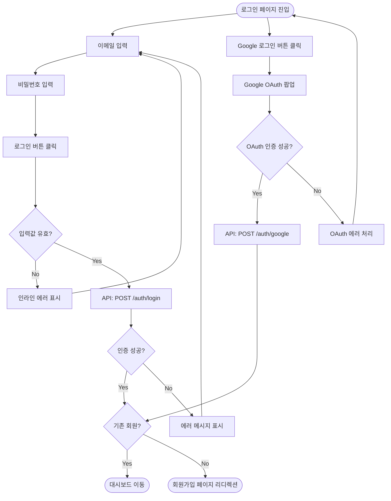

# CLAUDE.md — OpsGent Project

## 프로젝트 개요

OpsGent는 엔터프라이즈급 IT 운영 관리(IT Operations Management)환경을 제공하는 Agentic AI 기반의 AI SRE(Site Reliability Engineering)플랫폼이다. 인프라 모니터링, APM, 인시던트 대응, 권한 관리(RBAC)를 통합 제공하며, SAP/Salesforce 수준의 엔터프라이즈 제품 기획 기준을 따른다.

- **제품 유형**: B2B SaaS, IT Ops 플랫폼
- **주요 사용자**: 영어 사용자, DevOps 엔지니어, SRE, IT 관리자, 팀 리더
- **벤치마크 제품**: Resolve.ai (AI SRE 플랫폼)
- **랜딩페이지**: https://cocoa-lead-41746266.figma.site/
- **Figma 디자인**: https://www.figma.com/design/y5bosVJQewFatHUicHl4Bn/-WorkSpace--UX-UI-Design-Assets

---

## 벤치마크: Resolve.ai

OpsGent는 **Resolve.ai**(https://resolve.ai)를 표방한다. 기획, UI/UX 설계, 기능 정의 시 Resolve.ai의 접근 방식을 참조 하지만 사용성 및 개별 환경에 더 적합한 구조에 대한 아이디어 및 해결 방법이 있다면 그것을 추종한다. 디자인 Theme은 OptGent 고유의 Theme를 추종한다.

### Resolve.ai 핵심 개요

Resolve.ai는 Agentic AI 기반의 AI SRE(Site Reliability Engineering) 플랫폼이다. 2024년 전 Splunk 임원 Spiros Xanthos, Mayank Agarwal이 공동 창업했으며, 2026년 2월 Series A에서 $125M을 유치하고 $1B 기업가치를 달성했다.

### Resolve.ai 핵심 기능 (OpsGent 기획 시 참조)

| 기능 영역 | Resolve.ai 기능 | OpsGent 적용 방향 |
|----------|----------------|-----------------|
| 인시던트 조사 | 서비스 간 알림 상관관계 분석, 노이즈 필터링, 심각도/비즈니스 영향도 랭킹 | 인시던트 모듈에서 자동 분류 및 우선순위화 |
| 근본 원인 분석 (RCA) | 병렬 가설 기반 조사, 코드/인프라/텔레메트리 상관 분석, 증거 기반 타임라인 | APM 모듈에 RCA 자동화 기능 반영 |
| 자동 복구 | Git PR 생성, kubectl 명령 실행, 코드 수정/스크립트 자동 생성 | 인시던트 대응 자동화 워크플로우 |
| 지속적 학습 | 과거 인시던트/런북 학습, 반복 실수 방지, 베스트 프랙티스 강화 | 알림 모듈의 자동 대응 추천 |
| 문서화/커뮤니케이션 | 인시던트 자동 문서화, 티켓 업데이트, Slack 공유, 포스트모템 생성 | 보고서 모듈의 자동 리포트 생성 |
| 대화형 Q&A | 인시던트/개발 중 실시간 질의응답 | 에이전트 기반 운영 어시스턴트 |

### Resolve.ai 연동 생태계 (참조)
- **인프라/클라우드**: AWS, GCP, Azure, Kubernetes
- **코드/CI·CD**: GitHub, GitLab, Jenkins
- **커뮤니케이션/인시던트**: Slack, PagerDuty, Jira

### Resolve.ai 핵심 지표 (기획 목표 설정 시 참조)
- 알림/인시던트의 80% 자동 해결 목표
- 근본 원인 분석 속도 73% 향상 (인간 대비)
- 주니어 온콜 엔지니어 → 시니어 수준 효과 (2x 생산성 향상)
- 인시던트 발생 4~5시간 전 사전 감지 가능

### OpsGent vs Resolve.ai 포지셔닝

```
Resolve.ai: AI SRE — 인시던트 자동 해결에 특화된 Agentic AI 플랫폼
OpsGent:    IT Ops 통합 관리 — 모니터링 + APM + 인시던트 + RBAC를 통합한 운영 플랫폼
```

OpsGent는 Resolve.ai의 AI SRE 접근 방식을 벤치마킹하되, 인프라 모니터링, 권한 관리(RBAC), 보고서 등 엔터프라이즈 운영에 필요한 통합 관리 기능을 추가로 제공하는 방향으로 차별화한다.

---

## 시스템 아키텍처 (OpsGent-기획-03 기준)

> **참고 문서**: `OpsGent-기획-03.pdf` (2026.02.10)
> **제품 태그라인**: AI Native Observability & AIOps

### 백엔드 아키텍처 — Yard & OpsLake

```
WhaTap Observability Agents (1-101-1, 1-201-1)
  ↓
Router (OpsLake Driver) → Yard (OpsLake Driver) → Gateway (OpsLake Driver, Integration)
                                    ↓
                            OpsLake Server
                            ├── MySQL (영구 저장)
                            ├── MinIO (오브젝트 스토리지)
                            └── Redis (캐시)
  ↑                              ↓
Keeper (상태 관리)          Batch (OpsLake Driver)    Paper (OpsLake Driver)
                            ├── Anomaly Detection     ├── Statistics
                            ├── Root Cause            ├── Reporting
                            └── Backup & Archiving    └── ...

외부 서비스: Account, NotiHub, Front
```

**핵심 식별자 구조**: `wsid` (WorkSpace ID) + `product` (예: apm=101) + `sysid` (시스템 ID)

### AIOps Core Functions — 기능 플로우

```
회원가입 → 로그인 → 워크스페이스 생성 → 워크스페이스 관리 & 오버뷰
  ↓
Agent 설치 (install.sh → WhaTap Agent 실행)
  ↓
인벤토리 맵 (개별 서버 / 그룹)
  ├── 단일 서버: 자원(cpu, mem, net, disk i/o) + 프로세스 조회
  └── 그룹 서버: 그룹 자원(cpu, mem, net, disk i/o)
  ↓
Event 파이프라인:
  Event Rule 설정 → Event 처리/결과 → Event Delivery 처리/결과 → Event History 조회
  ↓
Incident 파이프라인:
  Incident Rule 설정 → Incident 처리/결과 → Incident Action (사용자 조치)
  → Incident AutoAction 처리 → Incident Delivery 처리/결과 → Incident History 조회
  ↓
ActionBook (AI 자동화):
  LLM 서비스 등록 → ActionBook 추천 (사전설정/사용이력) → ActionBook 생성 by LLM
  → ActionBook 전달/저장 → ActionBook 실행 (On Agent) → 실행결과 LogSink 저장
```

### ActionBook — AI-Driven Safe Runbook Automation

> ActionBook은 Observability와 AI를 연결하여, 사람을 깨우지 않고 안전하게 운영 작업을 수행하는 시스템이다.

**Why ActionBook?**
- 야간 운영 / 운영자 부재 대응
- 반복적인 일상 운영 자동화 (서비스 재기동, 설정 수정, 캐시/프로세스 정리)
- Alert 이후 사람 호출 없이 처리
- AI가 만들어도 바로 실행 가능한 안전성

**Core Design Principles:**

| 원칙 | 설명 |
|------|------|
| ① Safe DSL | 허용된 함수만 실행, Shell 직접 실행 불가 |
| ② Severity System | low / critical 분류, critical은 승인 필수 |
| ③ Built-in Rollback | STEP 단위 auto rollback, 실패 시 자동 복구 |
| ④ Execution Control | 감사로그, 중복 실행 방지 + 로그 추적 |
| ⑤ AI-Friendly | AI는 스크립트 생성만, 실행 권한은 DSL이 통제 |

**What과 How의 분리:**
- **YAML 함수 (What)**: Shell 명령 래핑, 입출력 정의, 심각도 설정, 파싱 규칙 — 운영팀(전문가) 관리
- **Act 스크립트 (How)**: 비즈니스 로직, 조건 분기, 에러 처리, 흐름 제어 — AI 또는 사용자(일반사용자) 작성

**ActionBook DSL 특성:**
1. 제한된 어휘 (Vocabulary): 정의된 함수만 사용 가능, 임의 Shell 명령 불가
2. 단순한 문법 (Simple Syntax): C/JS 스타일, 토큰 수 적음 → LLM 비용 절감
3. 검증 가능 (Verifiable): Dry-run, 실행 전 문법 검사, 사람 리뷰 가능
4. 추적 가능 (Traceable): Critical 함수 자동 로깅, 사고 시 원인 분석 가능

### AIOps Primary Use Flow

```
(1) Siren System → Incident 발생
(2) 사용자에게 Incident 알림
(3) AI Incident 분석 요청
(4) AI ActionBook 추천 요청
    ├── 조치 가능 작업 추천 (Past ActionBook)
    └── 새로운 작업 지시서 (New ActionBook)
(5) ActionBook 실행 요청 → WhaTap Agent
    ├── 체크: 에러체크, critical 함수체크, unknown 함수 체크
    ├── 실행
    ├── 결과: ParamPack(요약) + LogSinkPack(상세)
    └── Incident Action 등록 (ActionBook)
```

### ActionBook 실행 상세 흐름

```
사용자 → GateWay
  ⓐ Get ActionBook → OpsLakeServer
  ⓑ Fetch ActionBook ← MySQL
  ⓒ Run Request & ActBook (actbook-id, exec-id) → Yard
  ⓓ Run Request & ActBook → Router
  ⓔ Run Request & ActBook → WhaTap Agent (Built-in Functions)
  ⓕ Run ActionBook (Agent 내 실행)
  ⓖ Run Result → Router
  ⓗ Run Result → Yard → MXDB (Execution Details / LogSink)
  ⓘ Run Result → OpsLakeServer (Execution Summary)
  ⓙ Run Result → MySQL
```

### Agent 설치 프로세스

```
사전 조건: WorkSpace 생성 → AccessKey 생성 → 리전 선택 → 추가 프로덕트 (default: se, ap, db)
  ↓
install.sh 생성 → AWS S3에서 Agent 다운로드
  ├── whatap-agent-linux-x86_64.tar.gz
  ├── whatap-agent-linux-arm64.tar.gz
  ├── whatap-agent-darwin-arm64.tar.gz
  └── whatap-agent-windows-x86_64.zip
  ↓
Monitoring VM(or Host)에서 install.sh 실행 (root 권한)
  ├── /opt/whatap/conf (collector.conf, host.id)
  ├── /opt/whatap/infra
  ├── /opt/whatap/java
  └── /opt/whatap/php
```

> **핵심**: install.sh는 root 권한으로 host.id를 생성하고, 이를 inter-product linkage key로 사용한다.

---

## 제품 로드맵 (점진적 서비스 확대)

### Phase 1 — 파일럿 (현재)
**핵심 서비스**: Server Inventory 기반 인시던트/이벤트 관리 + AI 기능

| 모듈 | 범위 | 비고 |
|------|------|------|
| Infrastructure → Server Inventory | 서버 인벤토리 등록, 조회, 관리 | 핵심 데이터 기반 |
| 인시던트 | 인시던트 생성, 추적, 대응, 에스컬레이션 | Server Inventory 연동 |
| 알림 (이벤트) | 서버 이벤트 감지, 알림 발송, 자동 분류 | Server Inventory 연동 |
| AI 기능 | 인시던트 자동 분류, RCA 추천, 대응 자동화 | Agentic AI 기반 |
| Management → Authorization | RBAC 권한 관리 (Cross-Tenant) | 전 모듈 공통 |

### Phase 2 — 확장 (예정)
| 모듈 | 범위 |
|------|------|
| APM | 애플리케이션 성능 모니터링 |
| Overview | 통합 대시보드, 시스템 헬스 요약 |
| 보고서 | 운영 보고서 및 분석 |

### Phase 3 — 고도화 (예정)
| 모듈 | 범위 |
|------|------|
| Infrastructure (확장) | 인벤토리 맵, 토폴로지 시각화, 클라우드 리소스 통합 |
| 설정 | 워크스페이스 고급 설정, 연동 관리 |
| SSO / SAML / 2FA | 엔터프라이즈 인증 확장 |

> **원칙**: Server Inventory를 기반 데이터로 삼아 인시던트/이벤트/AI 기능을 우선 제공하고, 이후 모니터링 → 분석 → 자동화 순서로 서비스를 확대한다.

---

## 기술 스택 및 환경

### 디자인 도구
- Figma (UI/UX 디자인, 프로토타입, 디자인 시스템)
- Figma Sites (랜딩페이지 퍼블리싱)

### 문서 작성 도구
- docx-js (`npm install -g docx`) — Word 문서 생성
- Node.js — 문서 자동화 스크립트 실행 환경

### 사이드바 메뉴 구조

```
Overview
Workspace
  ├── Server Inventories
  ├── Events
  ├── Incidents
  └── Settings
Management
  ├── Members
  ├── Policies
  ├── Roles
  └── Audit Logs
```

> **Permission은 독립 메뉴가 아니다.** Permission(권한)은 Role 상세 뷰 내에서 할당/관리한다 (Role → 하위에서 Permission 할당). 별도의 Permissions 사이드바 메뉴는 존재하지 않는다.

### 플랫폼 아키텍처 (계층 구조)

```
Organization (최상위)
  └── Management (테넌트 상위 레이어)
        └── Authorization (RBAC 권한 관리)
              ├── 멤버(Member) 관리
              ├── 정책(Policy) 관리
              ├── 역할(Role) 관리 → 하위에서 Permission 할당
              └── 감사 로그(Audit Log)
  └── WorkSpace (테넌트 = 운영 단위)
        ├── Overview — 대시보드, 시스템 헬스 요약
        ├── APM — 애플리케이션 성능 관리
        ├── Infrastructure — 서버 인벤토리 관리
        ├── 보고서 — 운영 보고서 및 분석
        ├── 알림 — 알림 설정 및 관리
        ├── 인시던트 — 인시던트 추적 및 대응
        └── 설정 — 워크스페이스 설정
```

**핵심 원칙**: Authorization(권한 관리)는 **WorkSpace(테넌트) 상위에 위치**한다. 멤버가 어떤 WorkSpace에 접근할 수 있는지, WorkSpace 내에서 어떤 리소스에 어떤 액션을 수행할 수 있는지를 제어하는 교차 테넌트(Cross-Tenant) 레이어이다. AWS IAM이 개별 계정/리소스 위에 존재하는 것, Salesforce의 Org-level Permission Set이 개별 앱 위에 있는 것과 동일한 패턴이다.

**Permission 관리 방식**: Permission은 독립 화면 없이 Role 상세 뷰에서 관리한다. 역할 생성/수정 시 Permission을 체크박스로 할당하며, 역할 상세 페이지에서 할당된 Permission 목록을 확인할 수 있다.

### 핵심 모듈 구성

| 계층 | 모듈 | 설명 |
|------|------|------|
| Management (테넌트 상위) | Authorization | RBAC 기반 권한 관리 — WorkSpace를 관통하는 상위 레이어 |
| WorkSpace (테넌트) | Overview | 대시보드, 시스템 헬스 요약 |
| WorkSpace (테넌트) | APM | 애플리케이션 성능 관리 |
| WorkSpace (테넌트) | Infrastructure | 서버 인벤토리 관리 (인벤토리 맵, 인벤토리 관리) |
| WorkSpace (테넌트) | 보고서 | 운영 보고서 및 분석 |
| WorkSpace (테넌트) | 알림 | 알림 설정 및 관리 |
| WorkSpace (테넌트) | 인시던트 | 인시던트 추적 및 대응 |
| WorkSpace (테넌트) | 설정 | 워크스페이스 설정 |

---

## RBAC 권한 모델 (핵심 아키텍처)

OpsGent의 권한 관리는 **WorkSpace(테넌트) 상위에 위치**하며, 4개 엔티티로 구성된 계층형 RBAC 모델을 따른다:

```
Organization
  └── Authorization (Cross-Tenant Layer)
        └── 멤버(Member) → 정책(Policy) → 역할(Role) → 권한(Permission)
              └── 스코프: WorkSpace(테넌트) 단위로 권한 적용
```

### 엔티티 관계
- **멤버 → 정책**: M:N (멤버는 여러 정책에 소속 가능)
- **정책 → 역할**: M:N (정책은 여러 역할 포함 가능)
- **역할 → 권한**: 1:N (역할은 여러 권한 보유)
- **권한 → WorkSpace**: 권한은 WorkSpace(테넌트) 단위로 스코프가 적용됨
- **핵심 제약**: 멤버는 정책을 거치지 않고 역할에 직접 접근 불가

### 기본 역할 정의
| 역할 | 권한 | 스코프 |
|------|------|--------|
| View | APM_READ, DASHBOARD_READ | WorkSpace 내 읽기 전용 |
| Develop | LOG_READ, LOG_UPDATE, APM_READ, APM_UPDATE | WorkSpace 내 개발 리소스 |
| Management | ROLE_UPDATE, ROLE_CREATE, ROLE_DELETE | Cross-WorkSpace 관리 권한 |

### 권한 네이밍 패턴
`{DOMAIN}_{ACTION}` 형식. 예: `DASHBOARD_READ`, `LOG_UPDATE`

도메인: DASHBOARD, LOG, ROLE, APM, WORKSPACE
액션: READ, UPDATE, CREATE, DELETE

### WorkSpace(테넌트) 스코프 모델
- 권한은 특정 WorkSpace에 바인딩되거나 전체 WorkSpace에 적용 가능
- Management 역할은 Cross-WorkSpace 수준에서 동작 (멤버 초대, 역할/정책 관리)
- View, Develop 역할은 개별 WorkSpace 스코프 내에서 동작

---

## 기획문서 작성 포맷 (표준 템플릿)

> **트리거**: 사용자가 "기획문서 작성" 이라고 요청하면, 아래 7개 섹션 구조를 반드시 따른다.
> **참고 문서**: `Signin with E-mail and Password and Google OAuth.pdf` (인증 기획서 레퍼런스)

### 포맷 구조

```
1. 목적
2. 범위
   - 포함
   - 제외
3. 사용자 흐름 (Mermaid 다이어그램)
4. UI 스펙 (테이블)
5. 에러 분류 (테이블)
6. 정책 테이블 (테이블)
7. 개발 / QA 체크리스트 (테이블)
```

---

### 1. 목적

한 문단으로 해당 기능의 목적과 배경을 명확히 서술한다.

**작성 예시:**
> 사용자가 이메일/비밀번호 또는 Google OAuth를 통해 OpsGent 플랫폼에 안전하게 로그인할 수 있도록 한다.
> 기존 회원은 즉시 로그인되고, 비회원은 회원가입 페이지로 리디렉션된다.

---

### 2. 범위

**포함**과 **제외** 항목을 명확히 분리하여 기술한다.

**작성 형식:**

#### 포함
- 해당 기획에서 다루는 기능, 화면, 플로우를 나열

#### 제외
- 명시적으로 이번 기획에서 제외하는 범위를 나열

**작성 예시:**
> **포함**: 이메일+비밀번호 로그인, Google OAuth 로그인, 입력값 유효성 검증, 에러 처리
> **제외**: 회원가입, 비밀번호 재설정, Apple/GitHub 소셜 로그인, 2FA

---

### 3. 사용자 흐름

**반드시 Mermaid `flowchart TD` 형식으로 작성한다.** 사용자 관점의 주요 흐름을 다이어그램으로 시각화한다.

**작성 규칙:**
- `flowchart TD` (Top-Down) 방향 사용
- 시작/종료: 둥근 사각형 `([텍스트])`
- 프로세스: 사각형 `[텍스트]`
- 판단: 다이아몬드 `{텍스트}`
- 조건 분기: `-->|Yes|`, `-->|No|`
- Happy Path와 Error Path를 모두 포함

**작성 예시:**


---

### 4. UI 스펙

**테이블 형식으로 화면 요소별 상세 스펙을 정의한다.**

**컬럼 구성:**

| 요소 | 타입 | 필수 여부 | 유효성 검증 규칙 | 상태 | 비고 |
|------|------|----------|----------------|------|------|

**작성 예시:**

| 요소 | 타입 | 필수 여부 | 유효성 검증 규칙 | 상태 | 비고 |
|------|------|----------|----------------|------|------|
| 이메일 입력 | Text Input | 필수 | RFC 5322 형식, 최대 254자 | Default / Focus / Error / Disabled | placeholder: "이메일을 입력하세요" |
| 비밀번호 입력 | Password Input | 필수 | 최소 8자, 영문+숫자+특수문자 | Default / Focus / Error / Disabled | 표시/숨김 토글 아이콘 |
| 로그인 버튼 | Primary Button | - | 이메일+비밀번호 모두 입력 시 활성화 | Default / Hover / Loading / Disabled | 로딩 시 스피너 표시 |
| Google 로그인 | OAuth Button | - | - | Default / Hover / Loading | Google 브랜드 가이드라인 준수 |
| 비밀번호 찾기 링크 | Text Link | - | - | Default / Hover | 우측 하단 배치 |
| 에러 메시지 | Inline Alert | - | - | Hidden / Visible | 빨간색, 입력 필드 하단 |

---

### 5. 에러 분류

**테이블 형식으로 에러 코드, 조건, 사용자 메시지, 처리 방법을 정의한다.**

**컬럼 구성:**

| 에러 코드 | 에러 유형 | 발생 조건 | 사용자 메시지 | 처리 방법 |
|----------|----------|----------|-------------|----------|

**작성 예시:**

| 에러 코드 | 에러 유형 | 발생 조건 | 사용자 메시지 | 처리 방법 |
|----------|----------|----------|-------------|----------|
| AUTH_001 | 유효성 검증 | 이메일 형식 불일치 | "올바른 이메일 형식을 입력해주세요." | 인라인 에러 표시, 필드 포커스 |
| AUTH_002 | 유효성 검증 | 비밀번호 8자 미만 | "비밀번호는 8자 이상이어야 합니다." | 인라인 에러 표시 |
| AUTH_003 | 인증 실패 | 이메일 또는 비밀번호 불일치 | "이메일 또는 비밀번호가 올바르지 않습니다." | 토스트 또는 인라인 에러, 입력 초기화 안 함 |
| AUTH_004 | 계정 잠금 | 5회 연속 로그인 실패 | "보안을 위해 계정이 잠겼습니다. 30분 후 다시 시도해주세요." | 로그인 버튼 비활성화, 타이머 표시 |
| AUTH_005 | OAuth 실패 | Google 인증 취소/실패 | "Google 로그인에 실패했습니다. 다시 시도해주세요." | 로그인 페이지로 복귀 |
| AUTH_006 | 서버 에러 | API 5xx 응답 | "일시적인 오류가 발생했습니다. 잠시 후 다시 시도해주세요." | 재시도 버튼 표시 |
| AUTH_007 | 네트워크 | 타임아웃 (30초 초과) | "네트워크 연결을 확인해주세요." | 재시도 안내 |

---

### 6. 정책 테이블

**테이블 형식으로 비즈니스 규칙, 보안 정책, 제한 사항을 정의한다.**

**컬럼 구성:**

| 정책 ID | 정책명 | 규칙 | 값 / 조건 | 비고 |
|---------|-------|------|----------|------|

**작성 예시:**

| 정책 ID | 정책명 | 규칙 | 값 / 조건 | 비고 |
|---------|-------|------|----------|------|
| POL_001 | 비밀번호 정책 | 최소 길이 | 8자 이상 | 영문+숫자+특수문자 조합 필수 |
| POL_002 | 로그인 시도 제한 | 최대 연속 실패 | 5회 | 초과 시 30분 잠금 |
| POL_003 | 세션 유지 | 토큰 만료 시간 | Access: 30분, Refresh: 7일 | JWT 기반 |
| POL_004 | OAuth 정책 | 지원 프로바이더 | Google | Apple/GitHub은 향후 지원 |
| POL_005 | Rate Limiting | API 호출 제한 | 분당 60회 | IP 기반 제한 |
| POL_006 | 감사 로깅 | 로그인 이력 기록 | 모든 성공/실패 기록 | IP, User-Agent, 타임스탬프 포함 |

---

### 7. 개발 / QA 체크리스트

**테이블 형식으로 구현 및 테스트 항목을 정의한다.**

**컬럼 구성:**

| 구분 | 체크 항목 | 우선순위 | 담당 | 상태 |
|------|----------|---------|------|------|

**작성 예시:**

| 구분 | 체크 항목 | 우선순위 | 담당 | 상태 |
|------|----------|---------|------|------|
| FE | 이메일 입력 필드 유효성 검증 (RFC 5322) | P0 | 프론트엔드 | 미착수 |
| FE | 비밀번호 표시/숨김 토글 동작 | P1 | 프론트엔드 | 미착수 |
| FE | 로그인 버튼 로딩 상태 처리 | P0 | 프론트엔드 | 미착수 |
| FE | Google OAuth 팝업 플로우 구현 | P0 | 프론트엔드 | 미착수 |
| FE | 에러 메시지 인라인 표시 (AUTH_001~007) | P0 | 프론트엔드 | 미착수 |
| BE | POST /auth/login API 구현 | P0 | 백엔드 | 미착수 |
| BE | POST /auth/google OAuth 검증 API | P0 | 백엔드 | 미착수 |
| BE | 로그인 5회 실패 시 계정 잠금 처리 | P1 | 백엔드 | 미착수 |
| BE | JWT Access/Refresh Token 발급 | P0 | 백엔드 | 미착수 |
| BE | 로그인 감사 로그 기록 | P1 | 백엔드 | 미착수 |
| QA | 정상 로그인 (이메일+비밀번호) | P0 | QA | 미착수 |
| QA | 정상 로그인 (Google OAuth) | P0 | QA | 미착수 |
| QA | 잘못된 이메일 형식 에러 표시 | P0 | QA | 미착수 |
| QA | 5회 실패 후 계정 잠금 확인 | P1 | QA | 미착수 |
| QA | 네트워크 끊김 시 에러 처리 확인 | P2 | QA | 미착수 |
| QA | 반응형 레이아웃 (모바일/태블릿) | P2 | QA | 미착수 |

---

### 작성 시 주의사항

1. **"기획문서 작성"** 이라고 요청받으면 위 7개 섹션을 빠짐없이 포함할 것
2. **Mermaid 다이어그램**은 반드시 `flowchart TD` 형식, Happy Path + Error Path 포함
3. **테이블**은 빈 셀 없이 모든 컬럼 채울 것
4. **에러 코드**는 `{모듈}_{순번}` 형식 (예: AUTH_001, RBAC_001, INF_001)
5. **우선순위**는 P0(필수) > P1(중요) > P2(권장) 3단계로 분류
6. **정책 ID**는 `POL_{순번}` 형식으로 일관되게 부여
7. 참고 문서(PDF 등)가 첨부되면 해당 내용을 반영하여 구체화할 것

---

## 코딩 컨벤션 및 규칙

### 언어 및 응답 규칙
- **기본 언어**: 한국어 (기술 용어는 영문 유지)
- **문서 작성**: SAP/Salesforce 수준의 엔터프라이즈 기획 문서 품질 기준
- **PRD 구조**: Executive Summary → 아키텍처 → 기능 요구사항 → UI/UX → 데이터 모델 → API → 비기능 요구사항 → 파일럿 고려사항

### 문서 생성 규칙 (docx)
- 반드시 `docx-js` 라이브러리 사용 (`require('docx')`)
- 페이지 크기: US Letter (12240 x 15840 DXA)
- 기본 폰트: Arial
- 테이블은 반드시 `WidthType.DXA` 사용 (PERCENTAGE 금지)
- 테이블 `columnWidths` 합계 = 테이블 전체 너비와 일치
- `ShadingType.CLEAR` 사용 (SOLID 금지)
- 유니코드 불릿 직접 삽입 금지 → `LevelFormat.BULLET` 사용
- 줄바꿈에 `\n` 사용 금지 → 별도 `Paragraph` 생성

### 컬러 시스템
```javascript
const COLORS = {
  primary: "1A3E72",    // 제목, 주요 헤딩
  secondary: "2D6BCF",  // 부제목, CTA 버튼
  accent: "4A90D9",     // H3 헤딩
  headerBg: "1A3E72",   // 테이블 헤더 배경
  headerText: "FFFFFF", // 테이블 헤더 텍스트
  lightBg: "F0F4FA",    // 테이블 교대 행 배경
  tableBorder: "C0C8D4", // 테이블 테두리
  text: "2C3E50",       // 본문 텍스트
  subText: "5D6D7E",    // 보조 텍스트
};
```

---

## Figma 디자인 참조

### Figma 파일 구조

#### UX/UI Design Assets (`y5bosVJQewFatHUicHl4Bn`)

| 페이지 | 노드 ID | Figma 링크 |
|--------|---------|-----------|
| Landing Page | `0:1` | [Figma 열기](https://www.figma.com/design/y5bosVJQewFatHUicHl4Bn/-WorkSpace--UX-UI-Design-Assets?node-id=0-1) |
| Signup | `3:1836` | [Figma 열기](https://www.figma.com/design/y5bosVJQewFatHUicHl4Bn/-WorkSpace--UX-UI-Design-Assets?node-id=3-1836) |
| Signin & Reset Password | `3:1837` | [Figma 열기](https://www.figma.com/design/y5bosVJQewFatHUicHl4Bn/-WorkSpace--UX-UI-Design-Assets?node-id=3-1837) |
| Overview | `5:1935` | [Figma 열기](https://www.figma.com/design/y5bosVJQewFatHUicHl4Bn/-WorkSpace--UX-UI-Design-Assets?node-id=5-1935) |
| Management → Authorization | `2404:2876` | [Figma 열기](https://www.figma.com/design/y5bosVJQewFatHUicHl4Bn/-WorkSpace--UX-UI-Design-Assets?node-id=2404-2876) |

#### Design System (`ZKykAw3S8mT4YSPH1L4h0W`)

| 파일 | Figma 링크 |
|------|-----------|
| WorkSpace Design System | [Figma 열기](https://www.figma.com/design/ZKykAw3S8mT4YSPH1L4h0W/-WorkSpace--Design-System) |

### Authorization 섹션 내 화면 목록
| 노드 ID | 화면명 | 설명 |
|---------|--------|------|
| 2404:3410 | 권한 설정 - 정책 관리 | 정책 목록 + CRUD |
| 2404:3409 | 정책 생성 | 정책 생성 폼 |
| 2404:3447 | 정책 상세 | 정책 상세 (멤버/역할 목록) |
| 2404:3483 | 권한 설정 - 멤버 관리 | 멤버 목록 + 초대 |
| 2404:3501 | 멤버 상세 | 멤버 상세 (정책/역할 목록) |
| 2404:3517 | 권한 설정 - 역할 관리 | 역할 목록 + CRUD |
| 2404:3427 | 역할 상세 | 역할 상세 (정책/멤버/권한 목록) |
| 2404:3536 | 멤버-역할-권한 관계도 | RBAC 관계 다이어그램 |
| 2404:3560 | 로그인 플로우 | 로그인/온보딩 플로우차트 |
| 2404:3592 | 서버 인벤토리 관리 | Infrastructure 인벤토리 화면 |
| 2404:3637 | 멤버 초대 | 멤버 초대 모달 (미완성) |
| 2404:3638 | 역할 생성 | 역할 생성 모달 (미완성) |
| 2404:3639 | 권한 생성 | 권한 생성 모달 (미완성) |
| 2404:3464 | 기본 | 기본 네비게이션 레이아웃 |

### UI 디자인 패턴
- **네비게이션**: 고정 좌측 사이드바 (계층형 메뉴)
- **테이블 행 선택**: 보라색 하이라이트
- **CTA 버튼**: 파란색 채움 (`+ 생성` 형식, 우측 상단 배치)
- **태그 표시**: `[View]`, `[Management]` 대괄호 형식
- **어노테이션**: 빨간색 텍스트 (파일럿 제외 사항 표시)

---

## 파일럿 단계 제외 항목

Figma 빨간색 어노테이션 기준, 파일럿에서 제외되는 기능:

| 화면 | 제외 기능 |
|------|----------|
| 멤버 관리 | '연결된 정책' 컬럼 |
| 정책 관리 | '멤버 수' 컬럼 |
| 역할 관리 | '연결된 멤버' 수 |
| 멤버 초대 / 역할 생성 | 전체 워크플로우 (디자인 미완). 권한 생성 독립 모달은 폐기 — Permission은 Role 상세 뷰에서 할당 |

---

## 산출물 관리

### 파일 네이밍 규칙
- PRD: `OpsGent_PRD_{모듈명}_{언어}.docx`
- 기능 정의서: `OpsGent_FSD_{모듈명}_{언어}.docx`
- API 명세: `OpsGent_API_{모듈명}_{버전}.docx`

### 생성된 산출물
| 파일명 | 설명 | 버전 |
|--------|------|------|
| OpsGent_PRD_Authorization_Module.docx | 권한 관리 모듈 PRD (영문) | v1.0 |
| OpsGent_PRD_권한관리모듈_KR.docx | 권한 관리 모듈 PRD (한국어) | v1.0 |
| OpsGent_기획문서_Authorization.md | Authorization 기획문서 (7섹션 + 부록) | v1.1 |
| OpsGent_제품방향성.md | 제품 방향성 (비즈니스/제품/고객) | v1.0 |

---

## API 설계 가이드라인

### REST API 엔드포인트 네이밍
- 기본 경로: `/api/v1/`
- 리소스명: 복수형 소문자 (예: `/members`, `/roles`, `/policies`, `/permissions`)
- CRUD 매핑: GET(조회), POST(생성), PUT(수정), DELETE(삭제)

### 주요 엔드포인트
```
/api/v1/members          — 멤버 관리
/api/v1/members/invite   — 멤버 초대
/api/v1/roles            — 역할 관리
/api/v1/roles/:id/permissions — 역할 하위 Permission 할당/관리
/api/v1/policies         — 정책 관리
/api/v1/auth/login       — 인증
/api/v1/workspaces       — 워크스페이스 관리
```

---

## 비기능 요구사항 기준

| 항목 | 목표치 |
|------|--------|
| 권한 검증 지연 | 요청당 < 100ms |
| 멤버 목록 로드 (1,000명+) | < 2초 |
| 동시 접속 사용자 | 10,000명+ |
| 워크스페이스당 역할 수 | 500개+ |
| 세션 관리 | JWT + Refresh Token 로테이션 |
| 권한 평가 | 기본 거부(Deny-by-default) |
| 가동률 SLA | 99.9% |
| 감사 로깅 | 모든 RBAC 변경 타임스탬프 + 작업자 기록 |

---

## 작업 시 주의사항

1. **Figma 노드 접근**: `get_design_context` 호출 시 결과가 너무 크면 하위 섹션 노드 ID로 분할 호출
2. **한국어 문서**: 기술 용어(RBAC, API, CRUD, JWT 등)는 영문 유지, 설명은 한국어
3. **테이블 설계**: 항상 `WidthType.DXA` 사용, 컬럼 너비 합계 = 콘텐츠 영역 너비(9360 DXA)
4. **파일럿 구분**: 빨간색 어노테이션으로 표시된 제외 항목 반드시 별도 섹션으로 관리
5. **SAP/Salesforce 참조**: 권한 모델 설명 시 SAP Authorization Object, Salesforce Permission Set 용어 병기
